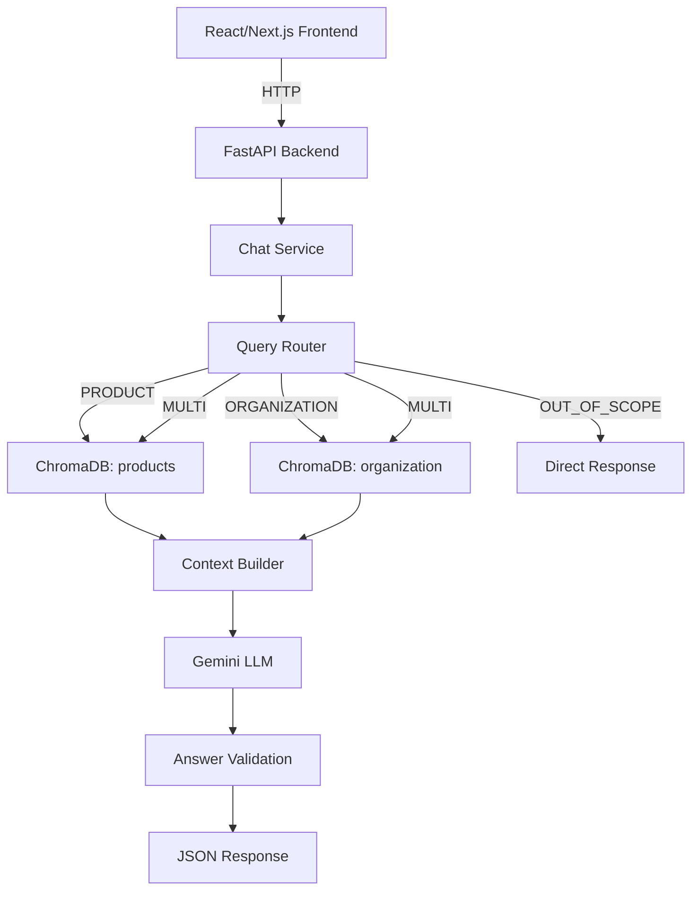

# QICDOCK RAG Chatbot

A production-ready Retrieval-Augmented Generation (RAG) chatbot backend for QICDOCK automotive accessories. The chatbot answers questions using two knowledge sources: product catalog from Excel and organization information from Markdown files.

## Architecture



## Tech Stack

- **Backend**: Python 3.11+, FastAPI, Uvicorn
- **Data Processing**: Pandas, OpenPyXL
- **Vector Database**: ChromaDB (persistent)
- **Embeddings**: Sentence Transformers (all-MiniLM-L6-v2)
- **LLM**: Google Gemini (configurable)
- **Configuration**: Pydantic Settings
- **Testing**: pytest, pytest-asyncio

## Project Structure

```
rag-chatbot/
├── app/
│   ├── __init__.py
│   ├── main.py
│   ├── api/
│   │   ├── __init__.py
│   │   ├── chat.py
│   │   └── health.py
│   ├── core/
│   │   ├── __init__.py
│   │   ├── config.py
│   │   └── logging.py
│   ├── models/
│   │   ├── __init__.py
│   │   ├── chat.py
│   │   └── documents.py
│   ├── rag/
│   │   ├── __init__.py
│   │   ├── ingestion.py
│   │   ├── ingestion_org.py
│   │   ├── chunking.py
│   │   ├── embeddings.py
│   │   ├── embeddings_provider.py
│   │   ├── chroma.py
│   │   ├── router.py
│   │   ├── retriever.py
│   │   ├── context.py
│   │   └── generator.py
│   ├── services/
│   │   ├── __init__.py
│   │   ├── llm.py
│   │   └── chat_service.py
│   └── prompts/
│       ├── system_prompt.txt
│       └── router_prompt.txt
├── data/
│   ├── products/
│   │   └── qicdock_products_catalog.xlsx
│   └── organization/
│       ├── company.md
│       ├── policies.md
│       ├── faq.md
│       └── contact.md
├── scripts/
│   ├── ingest_products.py
│   ├── ingest_organization.py
│   └── ingest_all.py
├── chroma_db/
├── tests/
│   ├── __init__.py
│   ├── test_ingestion.py
│   ├── test_retrieval.py
│   ├── test_router.py
│   └── test_chat.py
├── .env
├── .env.example
├── .gitignore
├── requirements.txt
├── Dockerfile
├── README.md
└── run.py
```

## Installation

1. Clone the repository
2. Create virtual environment:
   ```bash
   python -m venv venv
   source venv/bin/activate  # On Windows: venv\Scripts\activate
   ```
3. Install dependencies:
   ```bash
   pip install -r requirements.txt
   ```

## Environment Setup

Copy `.env.example` to `.env` and configure:

```env
APP_ENV=development

GEMINI_API_KEY=your-gemini-api-key
GEMINI_MODEL=gemini-1.5-flash

EMBEDDING_PROVIDER=sentence-transformers
EMBEDDING_MODEL=all-MiniLM-L6-v2

CHROMA_PATH=./chroma_db
PRODUCT_COLLECTION=products
ORGANIZATION_COLLECTION=organization

TOP_K=5
RELEVANCE_THRESHOLD=1.5

CHUNK_SIZE=700
CHUNK_OVERLAP=100

MAX_HISTORY_MESSAGES=10

CORS_ORIGINS=http://localhost:3000
```

**Required**: `GEMINI_API_KEY` - Get from [Google AI Studio](https://makersuite.google.com/app/apikey)

## Data Format

### Product Excel (`data/products/qicdock_products_catalog.xlsx`)

Columns:
- `source_id`, `product_name`, `category`, `brand`
- `vehicle_make`, `vehicle_model`, `compatibility`
- `price_inr`, `mrp_inr`, `discount_percent`
- `availability`, `stock_quantity`, `sku`
- `description`, `features`
- `product_url`, `image_url`
- `rating`, `review_count`
- `source_type`, `source_reference`

### Organization Knowledge (`data/organization/*.md`)

Markdown files for:
- `company.md` - Company info, mission, products, services
- `policies.md` - Return, refund, shipping, warranty, cancellation, payment
- `faq.md` - Frequently asked questions
- `contact.md` - Contact information, support channels

## ChromaDB Setup

Uses persistent ChromaDB at `./chroma_db` with two collections:
- `products` - Product catalog embeddings
- `organization` - Organization knowledge embeddings

## Ingestion Commands

```bash
# Ingest products only
python scripts/ingest_products.py

# Ingest organization knowledge only
python scripts/ingest_organization.py

# Ingest both
python scripts/ingest_all.py
```

Example output:
```
============================================================
QICDOCK Product Ingestion
============================================================
Loading Excel file: data/qicdock_products_catalog.xlsx
Found 10 products.
Creating product documents...
Generating embeddings...
Inserted 10 products into ChromaDB.
Done.

Ingestion Complete!
  Products processed: 10
  Chunks inserted: 10
  Failed: 0

SUCCESS: Products ingested into ChromaDB
```

## Running the Backend

```bash
# Development
python run.py

# Or directly with uvicorn
uvicorn app.main:app --host 0.0.0.0 --port 8000 --reload
```

Server starts at `http://localhost:8000`
- API Docs: `http://localhost:8000/docs`
- ReDoc: `http://localhost:8000/redoc`
- Health: `http://localhost:8000/health`

## API Documentation

### Chat Endpoint

**POST** `/api/chat`

Request:
```json
{
  "message": "What is the price of the Toyota Glanza wireless charger?",
  "session_id": "optional-session-id"
}
```

Response:
```json
{
  "answer": "The Toyota Glanza Wireless Phone Charger costs ₹2349 (MRP ₹3449, 32% discount).",
  "intent": "PRODUCT",
  "sources": [
    {
      "type": "product",
      "product_name": "Toyota Glanza Wireless Phone Charger | Charging Pad",
      "metadata": {...}
    }
  ],
  "session_id": "abc123..."
}
```

### Health Endpoint

**GET** `/health`

Response:
```json
{
  "status": "ok",
  "service": "rag-chatbot"
}
```

## Example Requests

### Product Questions
```bash
curl -X POST http://localhost:8000/api/chat \
  -H "Content-Type: application/json" \
  -d '{"message": "What is the price of the Mahindra XUV 3XO wireless charger?"}'

curl -X POST http://localhost:8000/api/chat \
  -H "Content-Type: application/json" \
  -d '{"message": "Does the Toyota Glanza charger support iPhone 15?"}'
```

### Organization Questions
```bash
curl -X POST http://localhost:8000/api/chat \
  -H "Content-Type: application/json" \
  -d '{"message": "What is your return policy?"}'

curl -X POST http://localhost:8000/api/chat \
  -H "Content-Type: application/json" \
  -d '{"message": "How long does shipping take?"}'
```

### Multi-source Questions
```bash
curl -X POST http://localhost:8000/api/chat \
  -H "Content-Type: application/json" \
  -d '{"message": "What is the price of the Swift charger and what is your warranty?"}'
```

### Out of Scope
```bash
curl -X POST http://localhost:8000/api/chat \
  -H "Content-Type: application/json" \
  -d '{"message": "Who is the president of the USA?"}'
```

### Follow-up Questions (using session_id)
```bash
# First question
curl -X POST http://localhost:8000/api/chat \
  -H "Content-Type: application/json" \
  -d '{"message": "What is the price of the Dzire charger?", "session_id": "session-123"}'

# Follow-up
curl -X POST http://localhost:8000/api/chat \
  -H "Content-Type: application/json" \
  -d '{"message": "Does it support MagSafe?", "session_id": "session-123"}'
```

## Testing

```bash
# Run all tests
pytest tests/ -v

# Run specific test file
pytest tests/test_router.py -v
pytest tests/test_ingestion.py -v
pytest tests/test_chat.py -v
```

## Deployment

### Docker

```bash
docker build -t rag-chatbot .
docker run -p 8000:8000 --env-file .env rag-chatbot
```

### Render

1. Connect repository to Render
2. Create Web Service
3. Build Command: `pip install -r requirements.txt`
4. Start Command: `uvicorn app.main:app --host 0.0.0.0 --port $PORT`
5. Add environment variables from `.env.example`

**Note**: ChromaDB uses local persistent storage. On ephemeral platforms like Render, data won't survive redeploys. For production, consider:
- Mounting persistent disk
- Using managed vector database (Pinecone, Weaviate, etc.)
- Implementing background sync jobs

## Future Improvements

- PostgreSQL for product catalog with live sync
- Redis for conversation memory and caching
- Hybrid search (BM25 + semantic)
- Reranking with cross-encoders
- Authentication & rate limiting
- Observability (LangSmith, Prometheus)
- Background ingestion jobs
- Live inventory synchronization

## Security

- API keys never logged or exposed
- Request validation with Pydantic
- CORS configured for specific origins
- Prompt injection protection via context delimiting
- Input length limits
- Structured error responses (no stack traces)

## License

Proprietary - QICDOCK Automotive Accessories